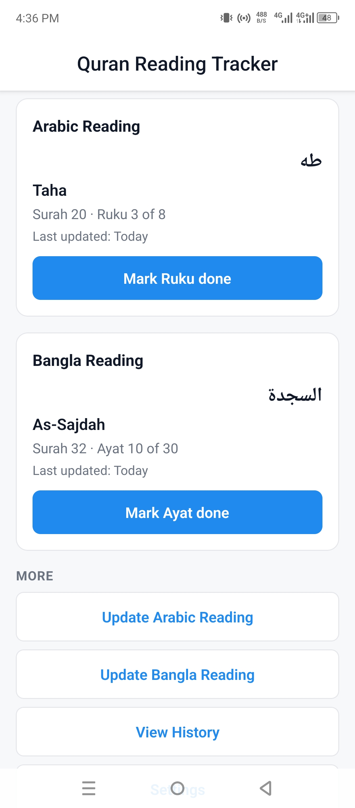
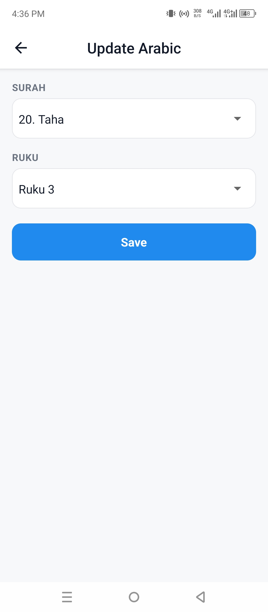
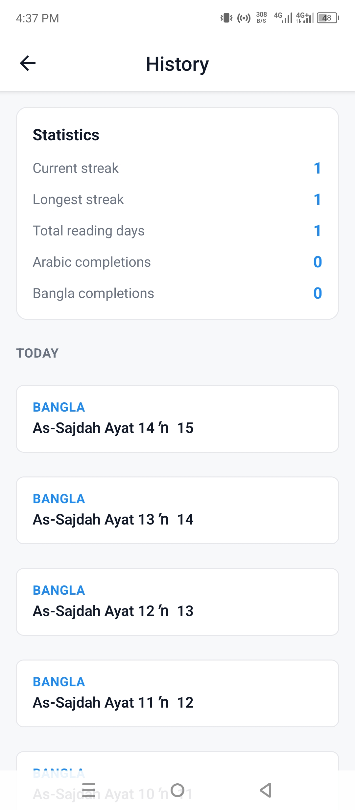

# Quran Reading Tracker

An offline-first Expo/React Native app for tracking daily Quran reading progress
along two completely independent tracks — Arabic reading by Surah + Ruku, and
Bangla translation reading by Surah + Ayat.

## Badges


## Table of Contents

- [About](#about)
- [Features](#features)
- [Screenshots](#screenshots)
- [Tech Stack](#tech-stack)
- [Getting Started](#getting-started)
  - [Build your own installable APK](#build-your-own-installable-apk)
  - [Download the APK](#download-the-apk)
- [Project Structure](#project-structure)
- [How This Project Was Built](#how-this-project-was-built)
- [Data Sources & Acknowledgments](#data-sources--acknowledgments)
- [Roadmap](#roadmap)
- [Contributing](#contributing)
- [License](#license)

## About

This is a personal, offline-first reading tracker for the Quran. It maintains
two fully independent progress records — Arabic reading (Surah + Ruku) and
Bangla translation reading (Surah + Ayat) — because the two habits advance at
different speeds and must never interfere with each other. Everything runs on
the device: a single local user, no accounts, no backend, no cloud, and no
internet connection required.

## Features

- **Home Screen & Live Progress**: Progress cards for Arabic and Bangla, both-tracks
  streak banner, visual progress bars (Surah % and total Quran %), and one-tap quick
  updates ("Mark Ruku done" / "Mark Ayat done").
- **Bangla Reading Stepper**: Multi-ayat advancement stepper (`[-]`, `[+]`, and
  preset chips `+1`, `+5`, `+10` up to +50) with in-flight double-tap protection.
- **Manual Update Screens**: Fast searchable modal sheet to find any Surah by
  number, transliteration, or Arabic name, plus direct numeric text inputs with
  stepper buttons.
- **Reading History & Statistics**: Chronological activity log with 12-hour
  Bangladeshi timestamps (`hh:mm AM/PM`), date grouping ("Today", "Yesterday"),
  latest track entry reversion (rolls back position and un-freezes completion),
  entry deletion, and lifetime stats.
- **End-of-Quran Handling**: Reaching the end of Surah 114 completes and freezes
  a track at An-Nas with celebration feedback and a "Start New Cycle" reset.
- **Configurable Daily Reminder**: Native 12-hour time picker dialog
  (`@react-native-community/datetimepicker`) and an ON/OFF toggle switch in Settings.
- **Backup & Restore**: Export and restore full JSON backups via system share
  sheet, document picker, or clipboard copy/paste; optional history cleanup.
- **Theming**: Complete Light, Dark, and System theme support across all screens.
- **Automated Tests**: Unit test suite powered by Vitest verifying domain logic,
  boundary rollovers, streak math, and backup validation.
- **Offline & Private**: 100% offline, zero tracking, progress never leaves the device.

## Screenshots







## Tech Stack

- Expo (SDK 57) + Expo Router (file-based routing)
- React Native + TypeScript (strict mode)
- `@react-native-async-storage/async-storage` for local persistence
- `expo-notifications` for local scheduled reminders only (never push)
- `@react-native-community/datetimepicker` for native reminder time selection
- `expo-sharing`, `expo-file-system`, `expo-document-picker`, `expo-clipboard` for backup/restore
- `vitest` for automated unit testing

## Getting Started

Requirements: Node.js + npm, a physical Android phone, and a free Expo account
(for EAS builds). This project does not use an Android emulator — all testing
is done on a real device.

### Build your own installable APK

Install the EAS CLI, log in with your Expo account, and start a preview build:

```bash
npm install -g eas-cli
eas login
eas build --platform android --profile preview
```

EAS builds the app's native code on Expo's servers — no local Android toolchain
needed — and returns a link to a single installable APK. Download it from that
link and install it on your phone. Building requires a free Expo account and
consumes free-tier build quota.

### Download the APK

Prefer to skip the build? A signed APK built from this repository is available
for direct download:

<https://expo.dev/accounts/shourov735s-team/projects/quran-reading-tracker/builds/fad1201b-f01e-45da-9e79-161a3428f744>

Install it on any Android device (you may need to allow installs from unknown
sources). The app runs standalone — Expo Go is not required.

## Project Structure

```
app/          Expo Router screens (file-based routing)
components/   Reusable presentational components (ProgressCard, SurahSearchModal)
domain/       Pure business logic (no React/RN imports)
data/         quran-metadata.json + typed loader
services/     Storage layer, notifications, backup/restore
types/        Shared TypeScript types
theme/        Colors, light/dark theme definitions
__tests__/    Automated Vitest unit test suites
```

## How This Project Was Built

The app was built in explicit phases (0–13), one feature at a time: metadata
layer → storage → progress logic → Home → update screens → reminder →
settings → history/stats → dark mode → polish → EAS build setup → README →
productivity improvements & testing. Each phase added a dated entry to
`PROGRESS_LOG.md` describing what was built, decisions made, and key notes.

- `AGENTS.md` — the full project spec and architecture rules
- `PROGRESS_LOG.md` — the complete build history

## Data Sources & Acknowledgments

`data/quran-metadata.json` (all 114 surahs, Arabic names, transliterations,
and ayah/ruku counts) was derived from the
[`malekverse/quran-dataset`](https://github.com/malekverse/quran-dataset)
project on GitHub, which is licensed under
[CC BY 4.0](https://creativecommons.org/licenses/by/4.0/).

Ayah counts are verified against the standard total of 6,236. Ruku counts come
from that dataset's own numbering, which totals 556 rukus — not the commonly
cited 558, a known variance between mushaf printing conventions. As a result,
a surah or two may differ by one ruku from your physical copy; this can be
corrected with the app's manual-edit feature.

## Roadmap

The following are documented future ideas — **not yet implemented**:

- Multiple daily reminders
- Monthly reading graph
- Cloud synchronization
- Widgets
- Bookmarking
- Verse notes
- Reading goals (e.g., finish one Juz every 10 days)
- Juz-based progress tracking
- Multiple translations

## Contributing

This is a public, MIT-licensed repository, meant to be cloned and forked.

1. Fork the repository on GitHub, then clone your fork:
   ```bash
   git clone https://github.com/<your-username>/QuranReadingTracker.git
   cd QuranReadingTracker
   ```
2. Install dependencies and run locally:
   ```bash
   npm install
   npx expo start
   ```
   Scan the QR code with Expo Go on a physical Android phone. This is the
   project's only supported dev/test workflow — no emulator.
3. Run tests:
   ```bash
   npm test
   ```
4. Before opening a pull request, read `AGENTS.md` — it contains the
   architecture rules, folder structure, and code style that all code must
   follow.

This is primarily a personal project, so responses to PRs and issues may be
slow — but contributions are welcome.

## License

[MIT](./LICENSE)
